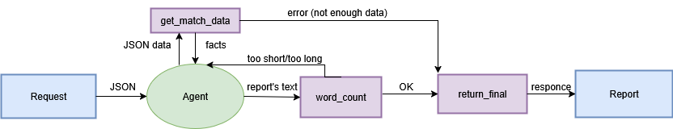

Úkol: Generování reportu z odehraného zápasu

Řešení: 

Zpočátku jsem nevěděl, jak k řešení tohoto úkolu přistoupit, protože je poměrně otevřený. Měl jsem několik nápadů:

1. Napsat šablony pro takový report pomocí Jinja2 nebo podobného nástroje
2. Model generující data do textu (NLG)
3. LLM AI Agent

Rozhodl jsem se pro třetí variantu, protože psaní šablon je velmi pracné a výsledkem je pouze opakující se styl, zatímco napsání modelu, který generuje text z dat, se mi zdálo jako velmi obtížný úkol. Třetí varianta je praktická a zajímavá pro realizaci, protože jsem se tím zabýval poprvé.

Použil jsem Vertex AI a framework Agent Development Kit (ADK) od Google, které mají velmi dobrou a srozumitelnou dokumentaci.

Jelikož v zadání nebylo uvedeno, jakým způsobem bychom data ukládali, vzal jsem jako základ formát JSON

Jak funguje můj agent:

 - Na vstupu obdrží požadavek Vytvoř report z následujících dat: match_json:{ ..data.. }

 - Tento požadavek je zpracován nástrojem get_match_data, který zkontroluje, zda data splňují minimální požadavky zadání (kdy se zápas hrál, kdo hrál,
jaký byl výsledek, zda byly rozdány nějaké karty a kopaly se penalty.) a vrací fakta spolu s příznaky, např. has_cards, has_penalty_shootout

- Poté již zpracovaná fakta z get_match_data jdou do požadavku LLM modelu, který pracuje pouze s nimi, aniž by přidával něco vymyšleného sám od sebe

 - Poté se návrh z modelu předá do nástroje word_count, který zkontroluje, zda délka textu odpovídá požadavku (260–340 slov)

 - Pokud je slov méně/více, word_count vrátí odpovídající vlajku a agent odešle nový dotaz do LLM

 - Když word_count vrátí úspěch, text se předá do return_final, který odpovídajícím způsobem vrátí finální text.

Tímto způsobem se mi podařilo implementovat agenta, který nejen píše požadovanou zprávu, ale také kontroluje vstupní data a délku zprávy. Takové řešení lze také snadno rozšířit nebo změnit pomocí nových nástrojů nebo dalších pravidel. 

Možná vylepšení: 
- Narazil jsem na problém, že model LLM nedokáže samostatně počítat slova v textu, a proto byl vytvořen nástroj word_count, ale jsem si jistý, že je možné obejít použití tohoto nástroje a zbytečného opakovaného volání modelu. 
- Přidání různých nastavení výstupu. 
- Různé zdroje vstupu.